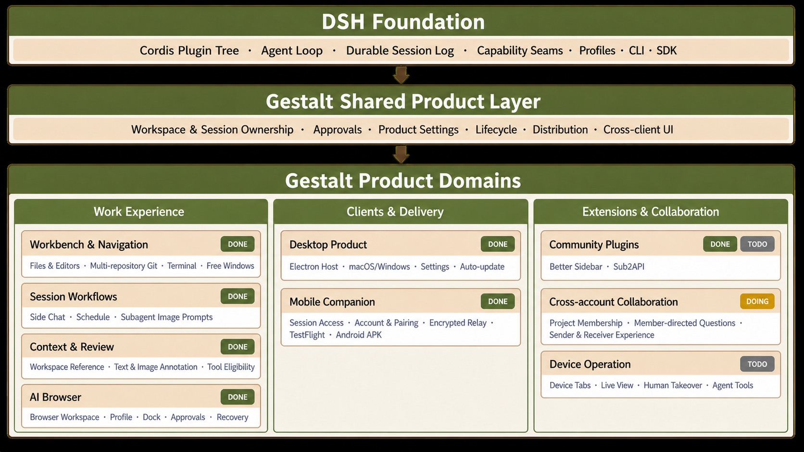

# Gestalt

English | [中文](README.zh.md)

<div align="center">
  
  <p><sub>Product name: Gestalt · Chinese name and IP character: 獭子哥</sub></p>
  <p><strong>Gestalt is the product layer for DeepSeek Harness.</strong></p>
  <p>
    <a href="https://www.gestaltrun.com/">Website</a> ·
    <a href="https://github.com/gestaltrun/deepseek-harness-gestalt/releases/latest">Download</a> ·
    <a href="docs/user/guide/index.md">Web guide</a> ·
    <a href="docs/architecture.md">Architecture</a>
  </p>
</div>

Gestalt is building a complete desktop, web, and mobile product on top of [DeepSeek Harness](https://www.deepseek.com/harness/) (`dsh`). Its Chinese product name and IP character are **獭子哥**. Gestalt keeps the official DSH plugin and runtime model as its base, fills in product workflows and distribution, and integrates strong community plugins behind tested product interfaces. The goal is a stable, usable product distribution rather than a collection of patches.

The project continuously merges the [official DSH repository](https://github.com/deepseek-ai/deepseek-harness) and keeps product additions on apps, bundles, plugins, and documented capability seams wherever possible. DSH profiles, plugins, CLI modes, and SDK entry points remain the compatibility baseline. Gestalt is still in developer preview, so compatibility-breaking changes remain possible while the product converges.

## Product panorama

Gestalt does not create another agent runtime. Official DSH supplies the plugin tree, agent loop, durable Session log, capability seams, Profiles, CLI, and SDK. Gestalt adds shared product settings, Workspace and Session ownership, approvals, lifecycle, UI components, and distribution, then assembles them into user-facing product areas.

<p align="center">
  
</p>

`DONE` means a function is on `master`, though it may be newer than the latest installer. `DOING` means the product area has an active delivery. `TODO` means the work is on the product plan. The table follows the same three product-area groups as the diagram and is the README's only product-status inventory. Each feature row contains at most one product recording so the walkthrough reads vertically.

| Product area | Completion | Product walkthrough | Product view |
|---|---|---|---|
| **Work experience** |  | Session workbench, side workflows, context review, and browser work |  |
| ├─ Workbench and navigation | `DONE`<br/>`TODO` [simplify Browser ownership](https://github.com/gestaltrun/deepseek-harness-gestalt/issues/226) | [Better Sidebar](packages/client/ui-better-sidebar/README.md) provides files, editors, multi-repository Git, Markdown/HTML, terminals, free windows, and agent-opened tabs; the [Workbench adapter](packages/client/ui-workbench/README.md) hosts the official Browser Runtime |  |
| ├─ Session workflows · Side Chat | `DONE` | Durable [Side Chat](packages/client/ui-better-sidebar/README.md) reuses the main Session conversation UI, model, permissions, jobs, and descendant navigation, and restores after a Host restart. Capable subagent providers also receive image prompts |  |
| ├─ Session workflows · Schedule | `DONE` | The [Schedule board](packages/client/ui-schedule/README.md) manages reminders created by the agent with pause, resume, and delete controls |  |
| ├─ Context and review · Workspace Reference | `DONE` | [Workspace Reference](packages/client/ui-reference/README.md) adds confined `@path` context through file search, folder descent, paste controls, and a Composer dock. Workspace settings control which tools may enter a Session |  |
| ├─ Context and review · Annotation | `DONE` | Text and image Annotation selects assistant text or pins images, attaches notes, restores drafts, and submits the result as an ordinary user message |  |
| └─ AI Browser | `DONE` | A Session owns zero or more [Browser Workspaces](packages/browser/browser-workspace/README.md) and tabs. Each Workspace may use a shared, temporary, or named persistent Profile. Browser Dock, approvals, restart recovery, and Session-owned teardown keep browser work inside the product lifecycle |  |
| **Clients and delivery** |  | Installable Desktop and Mobile clients, account access, pairing, and distribution |  |
| ├─ Desktop product | `DONE` | [Electron Host](apps/desktop/README.md), macOS and Windows installers, product window chrome, fullscreen Settings, staged auto-update, and owned shutdown and restart lifecycle | [Desktop and distribution](apps/desktop/README.md) |
| ├─ Mobile Companion · Session access | `DONE` | [Mobile](apps/mobile/README.md) browses, searches, and continues Desktop-owned Sessions with prompts, cancellation, approvals, questions, attachments, and live projection |  |
| └─ Mobile Companion · Account and pairing | `DONE` | Platform Account, Personal Pairing, encrypted Relay, concurrent phones, TestFlight delivery, and a signed Android APK. Desktop remains the authority for Sessions, Workspaces, attachments, approvals, and questions |  |
| **Extensions and collaboration** |  | Reviewed community integrations, cross-account work, and device control |  |
| ├─ Community plugins | `DONE` Better Sidebar<br/>`TODO` Sub2API | The [external plugin catalog](plugins/README.md) pins reviewed revisions. Better Sidebar is integrated; the optional Sub2API provider, installer, and embedded console are on the [product plan](https://github.com/gestaltrun/deepseek-harness-gestalt/issues/346) | [Plugin catalog](plugins/README.md) |
| ├─ Cross-account collaboration | `DOING` | Project membership and member-directed questions are in development. Sender routing, receiver experience, and [assembled acceptance](https://github.com/gestaltrun/deepseek-harness-gestalt/issues/345) follow | [Product plan](https://github.com/gestaltrun/deepseek-harness-gestalt/issues/338) |
| └─ Device operation | `TODO` | Planned sidebar phone tabs launch Android/iOS, show a live view, allow human takeover, and run approved agent tools | [Product plan](https://github.com/gestaltrun/deepseek-harness-gestalt/issues/355) |

Read the [architecture](docs/architecture.md) for the DSH plugin tree and capability seams. The [Desktop Host](apps/desktop/README.md), [Mobile](apps/mobile/README.md), and [external plugin catalog](plugins/README.md) document the three product delivery entries.

<a id="run"></a>

## Run Gestalt

### Desktop

Download the latest macOS or Windows build from [GitHub Releases](https://github.com/gestaltrun/deepseek-harness-gestalt/releases/latest).

### Web

Install [Node.js](https://nodejs.org/), then run:

```sh
npx @deepseek-ai/dsh web
```

The command starts the Web UI at `http://127.0.0.1:3080` and opens it for a local launch. Open **Settings → Models**, add a provider, choose a workspace, and start a Session. The [Web guide](docs/user/guide/index.md) covers the first run and SSH launches.

<a id="run-from-source"></a>

### From source

```sh
git clone https://github.com/gestaltrun/deepseek-harness-gestalt.git
cd deepseek-harness-gestalt
pnpm install
pnpm run build
pnpm dsh web
```

Use the [development guide](docs/development.md) for repository workflows and [AGENTS.md](AGENTS.md) for agent instructions.

## Community and support

- Report bugs and request features through [GitHub Issues](https://github.com/gestaltrun/deepseek-harness-gestalt/issues).
- Add the [`dsh-plugin`](https://github.com/topics/dsh-plugin) topic to a plugin repository so others can find it.
- Join the DeepSeek Harness WeCom group by adding the assistant and completing the survey.

<details>
  <summary>Community QR codes</summary>
  <table>
    <thead>
      <tr>
        <th align="center">WeCom assistant</th>
        <th align="center">Group survey</th>
        <th align="center">WeChat official account</th>
      </tr>
    </thead>
    <tbody>
      <tr>
        <td align="center"></td>
        <td align="center"><a href="https://trtgsjkv6r.feishu.cn/share/base/form/shrcnIt5twSVdLGD52KJBckGCgg"></a></td>
        <td align="center"></td>
      </tr>
    </tbody>
  </table>
</details>

## Contributing

See [CONTRIBUTING.md](CONTRIBUTING.md).

## License

[MIT](LICENSE). Third-party dependencies and their licenses are listed in [THIRD_PARTY_NOTICES.md](THIRD_PARTY_NOTICES.md).
