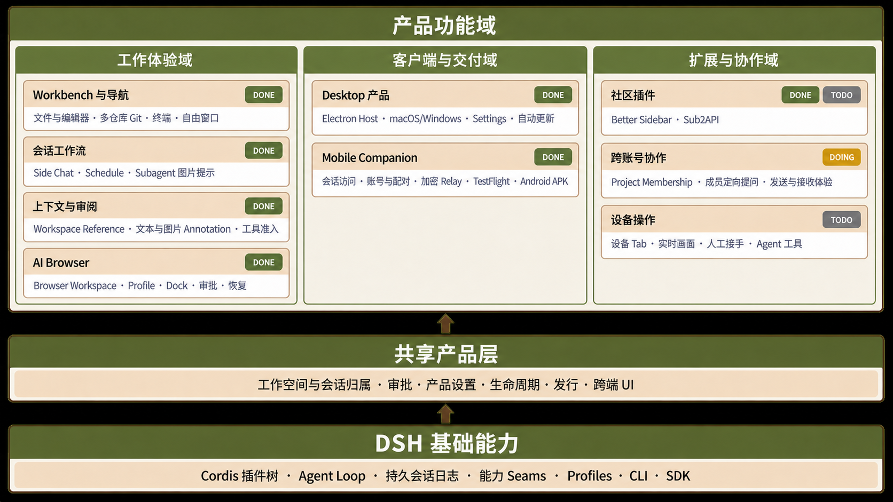

# 獭子哥（Gestalt）

[English](README.md) | 中文

<div align="center">
  
  <p><sub>英文产品名：Gestalt · 中文名与 IP 角色：獭子哥</sub></p>
  <p><strong>獭子哥是 DeepSeek Harness 的产品层。</strong></p>
  <p>
    <a href="https://www.gestaltrun.com/">网站</a> ·
    <a href="https://github.com/gestaltrun/deepseek-harness-gestalt/releases/latest">下载</a> ·
    <a href="docs/user/guide/index.zh.md">Web 指南</a> ·
    <a href="docs/architecture.zh.md">架构</a>
  </p>
</div>

獭子哥正在 [DeepSeek Harness](https://www.deepseek.com/harness/)（`dsh`）之上构建完整的桌面端、Web 端与移动端产品，英文产品名为 **Gestalt**。它以官方 DSH 的插件与运行时模型为基础，补齐产品工作流和发行能力，并通过经过测试的产品接口集成优秀社区插件。项目目标是稳定可用的产品发行，而不是补丁集合。

本项目持续合并 [DSH 官方仓库](https://github.com/deepseek-ai/deepseek-harness)的改动，并尽可能把产品增量放在应用、Bundle、插件和有文档说明的能力 seam 上。DSH Profile、插件、CLI（命令行界面）模式和 SDK 入口是兼容性基线。獭子哥目前仍处于开发者预览阶段，产品收敛过程中仍可能出现破坏兼容性的变更。

## 产品功能全景

獭子哥不另起一套 agent runtime。官方 DSH 提供插件树、agent loop、持久会话日志、能力 seam、Profile、CLI 和 SDK；Gestalt 在这套基础上增加统一的产品设置、工作空间与会话归属、审批、生命周期、共享 UI 和发行能力，再组成面向用户的产品域。

<p align="center">
  
</p>

`DONE` 表示功能已进入 `master`，但可能比最新安装包更新。`DOING` 表示产品域已有交付中的改动。`TODO` 表示已进入产品计划。下表使用与架构图一致的一级产品域和二级产品域列，也是 README 唯一的产品状态清单。每个功能行只放一张产品画面，便于纵向浏览。

| 一级产品域 | 二级产品域 | 完成度 | 具体产品功能导览 | 产品画面 |
|---|---|---|---|---|
| 工作体验域 | Workbench 与导航 | `DONE`<br/>`TODO` [简化 Browser 所有权](https://github.com/gestaltrun/deepseek-harness-gestalt/issues/226) | [Better Sidebar](packages/client/ui-better-sidebar/README.zh.md)提供文件、编辑器、多仓库 Git、Markdown/HTML、终端、自由窗口和由 agent 打开的 tab；[Workbench 适配器](packages/client/ui-workbench/README.zh.md)承载官方 Browser Runtime |  |
| 工作体验域 | 会话工作流 | `DONE` | 持久 [Side Chat](packages/client/ui-better-sidebar/README.zh.md)复用主会话的对话 UI、模型、权限、后台任务和下级导航，并在 Host 重启后恢复；具备相应能力的 subagent 提供方也可接收图片提示词 |  |
| 工作体验域 | 会话工作流 | `DONE` | [Schedule 任务板](packages/client/ui-schedule/README.zh.md)管理 agent 创建的提醒，支持暂停、恢复和删除 |  |
| 工作体验域 | 上下文与审阅 | `DONE` | [Workspace Reference](packages/client/ui-reference/README.zh.md)支持文件搜索、目录下钻、粘贴控制和 Composer dock，把受限的 `@path` 上下文加入会话；Workspace Settings 控制哪些工具可以进入会话 |  |
| 工作体验域 | 上下文与审阅 | `DONE` | 文本与图片 Annotation 支持选择 assistant 文本、在图片上放置标记、附加说明、恢复草稿，并作为普通用户消息提交 |  |
| 工作体验域 | AI Browser | `DONE` | 每个会话可拥有零个或多个 [Browser Workspace](packages/browser/browser-workspace/README.zh.md) 与 tab；Workspace 可使用 shared、temporary 或具名 persistent Profile，Browser Dock、审批、重启恢复和会话归属的关闭流程让浏览器工作留在产品生命周期内 |  |
| 客户端与交付域 | Desktop 产品 | `DONE` | [Electron Host](apps/desktop/README.zh.md)、macOS 与 Windows 安装包、产品窗口框架、全屏 Settings、分阶段自动更新、退出与重启生命周期 | [Desktop 与发行说明](apps/desktop/README.zh.md) |
| 客户端与交付域 | Mobile Companion | `DONE` | [Mobile](apps/mobile/README.zh.md)浏览、搜索和继续由 Desktop 管理的会话，并支持提示词、取消、审批、提问、附件与实时投影 |  |
| 客户端与交付域 | Mobile Companion | `DONE` | Platform Account、Personal Pairing、加密 Relay、多手机并发、TestFlight 交付和签名 Android APK；Desktop 继续持有会话、工作空间、附件、审批和提问权威 |  |
| 扩展与协作域 | 社区插件 | `DONE` Better Sidebar<br/>`TODO` Sub2API | [外部插件目录](plugins/README.zh.md)固定经过审阅的精确修订。Better Sidebar 已集成；可选 Sub2API 提供方、安装器和内嵌管理台进入[后续计划](https://github.com/gestaltrun/deepseek-harness-gestalt/issues/346) | [插件目录](plugins/README.zh.md) |
| 扩展与协作域 | 跨账号协作 | `DOING` | Project Membership 与成员定向提问正在建设；后续补齐发送方路由、接收体验和[整体验收](https://github.com/gestaltrun/deepseek-harness-gestalt/issues/345) | [产品计划](https://github.com/gestaltrun/deepseek-harness-gestalt/issues/338) |
| 扩展与协作域 | 设备操作 | `TODO` | 计划提供侧栏手机 tab，用于启动 Android/iOS、显示实时画面、由人接手和运行经过审批的 agent 工具 | [产品计划](https://github.com/gestaltrun/deepseek-harness-gestalt/issues/355) |

[架构文档](docs/architecture.zh.md)介绍 DSH 插件树和能力 seam；[Desktop Host](apps/desktop/README.zh.md)、[Mobile](apps/mobile/README.zh.md)与[外部插件目录](plugins/README.zh.md)分别介绍三个产品交付入口。

<a id="run"></a>

## 运行獭子哥

### 桌面端

从 [GitHub Releases](https://github.com/gestaltrun/deepseek-harness-gestalt/releases/latest) 下载最新的 macOS 或 Windows 版本。

### Web 端

安装 [Node.js](https://nodejs.org/)，然后运行：

```sh
npx @deepseek-ai/dsh web
```

该命令会在 `http://127.0.0.1:3080` 启动 Web UI，本机启动时还会自动打开页面。进入 **Settings → Models** 添加模型提供方，选择工作空间，然后开始一个会话。[Web 指南](docs/user/guide/index.zh.md)介绍首次使用与 SSH 启动方式。

<a id="run-from-source"></a>

### 从源码运行

```sh
git clone https://github.com/gestaltrun/deepseek-harness-gestalt.git
cd deepseek-harness-gestalt
pnpm install
pnpm run build
pnpm dsh web
```

仓库开发流程见[开发指南](docs/development.zh.md)，面向 agent 的说明见 [AGENTS.md](AGENTS.md)。

## 社区与支持

- 通过 [GitHub Issues](https://github.com/gestaltrun/deepseek-harness-gestalt/issues) 报告 bug 或提交功能建议。
- 为插件仓库添加 [`dsh-plugin`](https://github.com/topics/dsh-plugin) 话题，便于其他人发现。
- 添加企微小助手并填写问卷，即可加入 DeepSeek Harness 企微群。

<details>
  <summary>社区二维码</summary>
  <table>
    <thead>
      <tr>
        <th align="center">企微小助手</th>
        <th align="center">入群问卷</th>
        <th align="center">微信公众号</th>
      </tr>
    </thead>
    <tbody>
      <tr>
        <td align="center"></td>
        <td align="center"><a href="https://trtgsjkv6r.feishu.cn/share/base/form/shrcnIt5twSVdLGD52KJBckGCgg"></a></td>
        <td align="center"></td>
      </tr>
    </tbody>
  </table>
</details>

## 参与贡献

参见 [CONTRIBUTING.md](CONTRIBUTING.zh.md)。

## 许可证

[MIT](LICENSE)。第三方依赖及其许可证见 [THIRD_PARTY_NOTICES.md](THIRD_PARTY_NOTICES.md)。
